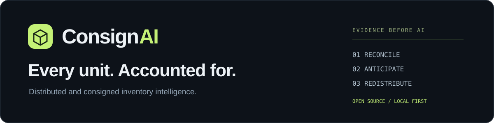
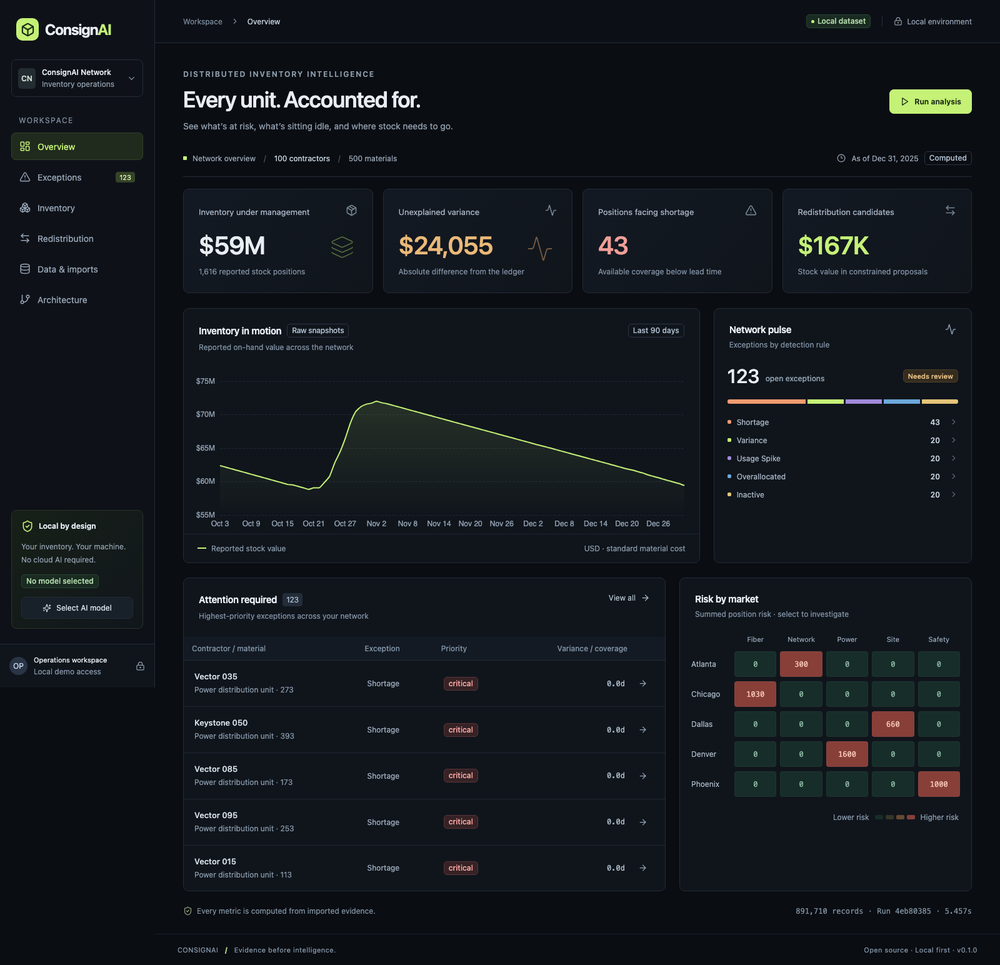
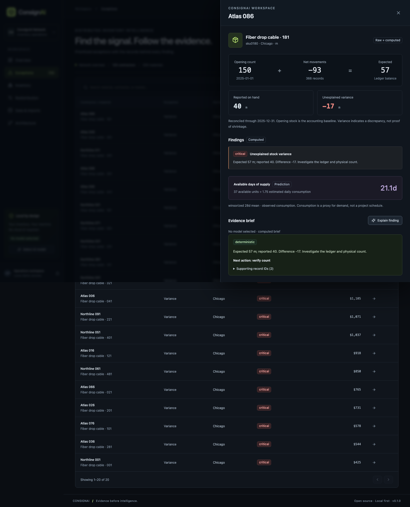
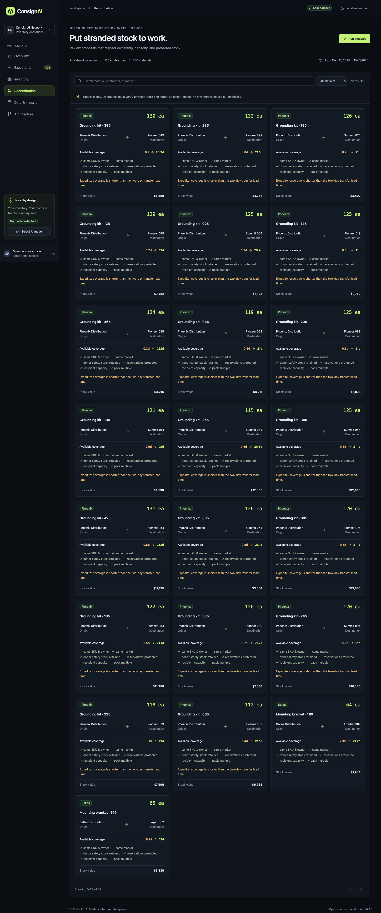
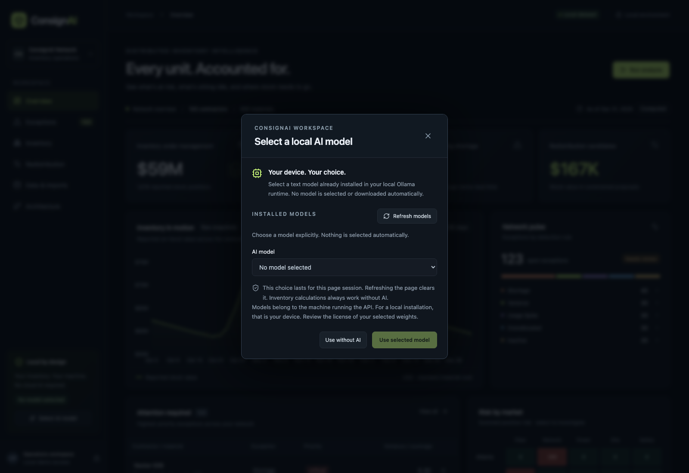
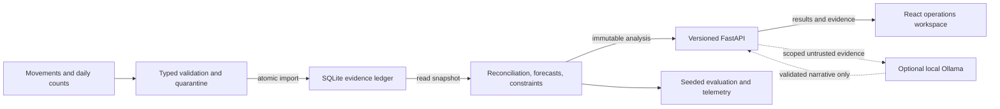

<p align="center"></p>

<p align="center"><strong>Find unexplained stock. See shortages coming. Put idle inventory back to work.</strong></p>
<p align="center">For materials managers, inventory control, contractors, and field deployment teams.</p>
<p align="center"><a href="#run-it-locally">Run the demo</a> · <a href="#follow-one-exception">See the workflow</a> · <a href="#measured-not-imagined">Inspect the benchmark</a> · <a href="docs/data-sources.md">Use your own data</a> · <a href="docs/architecture.md">Read the architecture</a></p>
<p align="center"><code>Apache-2.0</code> &nbsp; <code>100% local core</code> &nbsp; <code>No paid API</code> &nbsp; <code>AI optional</code></p>



> **An inventory system with an evidence trail.** ConsignAI reconciles distributed stock against its movement ledger, detects operational exceptions, estimates days of supply, and proposes constrained transfers. Every finding opens the records behind it.
>
> The screenshots use generated data. The benchmark is measured. The limitations are documented.

## Why this exists

A warehouse issues material. A contractor holds it. A crew consumes it. A field count arrives late. The next deployment requests more stock while another contractor has the same material sitting idle.

At that point, “on hand” is a claim that needs reconciliation. ConsignAI makes the chain inspectable:

```text
Opening count + receipts + issues in + transfers in + signed adjustments
              − issues out − transfers out − consumption
              = expected stock

Reported stock − expected stock = unexplained variance
```

A discrepancy is a reason to investigate—not proof of theft. A redistribution candidate is a proposal—not a posted transaction or a savings claim.

## Follow one exception

| Step | What the operator does | What the system provides |
|---|---|---|
| **01 · Find** | Filter exceptions by contractor, market or rule | Prioritized variance, usage, inactivity, allocation and coverage findings |
| **02 · Verify** | Open a position | Opening count, signed movements, reported count, provenance and the exact analysis run |
| **03 · Anticipate** | Review days of supply | Explicit 28-day consumption forecast with missing/censored-data handling |
| **04 · Rebalance** | Inspect redistribution candidates | Shared donor budgets, safety stock, reservations, owner/market/SKU constraints, capacity and pack sizes |
| **05 · Act** | Export an exception list | Filtered CSV for the operations review; proposals still require human authorization |

<details>
<summary><strong>Open the evidence workspace</strong></summary>
<br/>

</details>

<details>
<summary><strong>Review constrained redistribution</strong></summary>
<br/>

</details>

## What makes it technically interesting

**Accounting and AI have different jobs.** Python and SQL own every quantity, value, score, forecast and proposal. The optional local language model receives scoped evidence and selects a validated, rule-specific qualitative brief and evidence citations. It has no mutation tools. Bad output falls back to a deterministic brief.

**Evidence survives the workflow.** Imports are atomic. Conflicting IDs are rejected. Invalid records remain visible in validation reports. Analysis runs are immutable and can be retrieved by run ID, while the UI marks results stale after new data arrives.

**Allocation constraints are shared.** A donor's available surplus and a destination's remaining capacity are decremented across proposals, so the same stock is not recommended twice.

**The evaluation has an independent oracle.** A streaming replay checks SQL-derived balances. Seeded labels stay outside the detector. Forecasts are scored on later periods, and an independent validator checks proposal constraints.

## Core capabilities

- Enterprise ownership, warehouse, contractor and field stock positions.
- Receipts, issuance, consumption, balanced transfers, adjustments and daily snapshots.
- Expected-versus-reported reconciliation and source-linked exceptions.
- Robust usage anomalies, inactive stock, over-allocation, stale counts and shortage risk.
- Contractor and market coverage estimates; contractor/material and market/category risk matrices.
- Constrained, reviewable redistribution proposals.
- Atomic JSONL/CSV ingestion, visible validation reports and idempotent commands.
- Paginated REST API, OpenAPI documentation and CSV export.
- Persistent weekly analysis scheduling with catch-up after downtime.
- Choose an installed local Ollama model explicitly. No preset, automatic selection, or paid API; full operation without AI.
- Responsive dark interface, keyboard-accessible dialogs, loading/error/empty states and in-app architecture notes.

## Run it locally

Requirements: Docker Engine with Compose, or another compatible open-source container setup. No paid credentials. Internet is needed only to obtain packages/images and optional model weights.

```bash
# Replace the URL with this repository's URL after publishing.
git clone https://github.com/YOUR-USERNAME/consignai.git
cd consignai
cp .env.example .env
docker compose up --build
```

Open **[localhost:8080](http://localhost:8080)**. API docs: **[localhost:8077/docs](http://localhost:8077/docs)**.

The first launch generates and validates a full year for **100 contractors · 500 SKUs · 365 days**. It then computes the initial analysis. Wait for API readiness; the web container depends on that health check. Evidence persists in the `inventory` volume. Subsequent launches reuse it.

```bash
docker compose logs -f api   # follow first-run progress
docker compose down          # stop; retain the inventory volume
```

**Verification status:** the native application, backend/frontend tests, browser workflow and benchmark were run locally. Docker is not installed on the build Mac, so container execution remains an explicit release gate. GitHub Actions definitions include a Compose smoke test; no remote CI success is claimed before publication.

### Native development · macOS / Linux

Python 3.12+, Node.js 22+ and pnpm 11.25.0.

```bash
python3 -m venv .venv
source .venv/bin/activate
python -m pip install --upgrade pip
pip install -c requirements.lock '.[dev]'
python -m uvicorn apps.api.main:app --host 127.0.0.1 --port 8077
```

In a second terminal:

```bash
npm install -g pnpm@11.25.0
cd apps/web
pnpm install --frozen-lockfile
pnpm dev
```

Open [localhost:5177](http://localhost:5177). Native settings use environment variables; the API does not automatically load `.env`. Defaults are the synthetic demo with AI disabled. Keep one API worker.

### Native development · Windows PowerShell

```powershell
py -3.12 -m venv .venv
.\.venv\Scripts\python -m pip install --upgrade pip
.\.venv\Scripts\python -m pip install -c requirements.lock ".[dev]"
.\.venv\Scripts\python -m uvicorn apps.api.main:app --host 127.0.0.1 --port 8077
```

In another PowerShell window, run the same frontend commands above. For a separate workplace database, use `$env:DEMO_SEED="false"` and `$env:CONSIGNAI_DB="var/work.db"`. Native Windows execution is documented but was not tested on the build Mac. Use a current Node LTS and avoid syncing the live SQLite database through cloud-drive software.

## Bring your own sample data

The small committed fixture is compressed JSONL. The full demo is generated on first launch, keeping the repository small.

```bash
# Reproducible full dataset and separate ground-truth labels.
consignai generate --seed 42 --contractors 100 --skus 500 --days 365

# Import into a separate empty database, then analyze it.
consignai import data/generated/demo.jsonl.gz --db var/custom.db
consignai analyze --db var/custom.db

# A smaller fixture for inspection and tests.
consignai import data/sample/mini.jsonl.gz --db var/mini.db
consignai analyze --db var/mini.db
```

To use a custom database in the app, stop the API, set `CONSIGNAI_DB=var/custom.db` and `DEMO_SEED=false`, then restart it. Do not import a different synthetic catalog over the default one: shared IDs with different evidence correctly fail validation.

The **Data & imports** screen accepts uncompressed `.jsonl`, `.ndjson`, and `.csv` files up to 20 MiB. Import catalogs before dependent records. The CLI accepts generated `.jsonl.gz` files without the HTTP size limit. See the [data dictionary](docs/data-model.md) and [canonical schema](data/schemas/record.schema.json).

## Use it with workplace data

**Your ERP/WMS supplies the ledger. Contractors and field teams supply the counts and actual usage.** There are no prebuilt vendor connectors: map approved exports to CSV/JSONL, then import through the UI, API, or CLI.

| Bring this | From your existing operations |
|---|---|
| Materials and locations | ERP item master, contractor directory, warehouse/site register |
| Receipts, issues and transfers | WMS stock transactions and approved return documents |
| Actual consumption and adjustments | Field reports, work-order material usage and inventory-control journals |
| Daily on-hand and reserved stock | Warehouse balances, contractor count sheets and site stock reports |

Start with a **separate empty database** and `DEMO_SEED=false`. The first-run import screen guides you through catalogs → counts and movements → validation → analysis. Spreadsheet exports are supported after column mapping; arbitrary ERP reports and XLSX files are not parsed automatically.

**[Workplace setup and field mapping →](docs/data-sources.md)** · [Illustrative ten-record import](apps/web/public/templates/workplace-example.jsonl) · [Data dictionary](docs/data-model.md)

## API, with evidence

```bash
# Run a new analysis; retries with the same key replay the result.
curl -X POST http://localhost:8077/api/v1/commands/analyze \
  -H 'Content-Type: application/json' \
  -H 'Idempotency-Key: weekly-review-example-1' \
  -d '{}'

# Read a filtered, paginated exception list.
curl 'http://localhost:8077/api/v1/alerts?kind=variance&market=Chicago&limit=10'

# Trace a position back to its actual snapshots and movement ledger.
curl 'http://localhost:8077/api/v1/evidence/c000/sku0000?limit=25'

# Export the same operational exception scope.
curl 'http://localhost:8077/api/v1/export/exceptions.csv?kind=variance' \
  -o exceptions.csv
```

Read endpoints are separate from `/api/v1/commands/*`. Responses carry `X-Trace-ID`. Invalid requests use a consistent error envelope. Pagination accepts `limit` up to 250 and `offset`; `run_id` anchors supported queries to an immutable analysis. Health endpoints are `/health` and `/ready`.

For secured mode, set separate random `READ_API_KEY` and `WRITE_API_KEY` values of at least 24 characters and `APP_MODE=secured`. Reads use `Authorization: Bearer …`; commands use `X-API-Key`. Demo mode is intentionally anonymous and bound to loopback.

## Your device. Your model. No defaults.

Open **Select AI model** in the sidebar. ConsignAI reads models installed in your local Ollama runtime; nothing is preselected, downloaded, or loaded automatically. Choose an installed text model and click **Use selected model**. The choice lasts for this page session and clears on refresh. **Use without AI** returns to computed evidence briefs.



Only an explicit explanation request sends evidence to the chosen model. No selection means no model call, even if legacy model environment variables are set. An unavailable or invalid model falls back visibly to the computed brief; ConsignAI never silently substitutes another model. Remote/cloud-backed entries are excluded, and the selected model is checked again before sending evidence.

- **Native API + native Ollama:** start Ollama on your device. The endpoint is `http://127.0.0.1:11434` unless `OLLAMA_BASE_URL` specifies another allowed local host. Install your chosen weights separately, then refresh the picker.
- **Compose + native Ollama:** `.env.example` points at `http://host.docker.internal:11434`. The API container must be able to reach that host listener. On Linux, a loopback-only Ollama listener is not reachable over the Docker bridge; use the container option below or a carefully restricted host listener. Never expose an unauthenticated model server to an untrusted network.
- **Compose-managed Ollama:** set `OLLAMA_BASE_URL=http://ollama:11434`, run `docker compose --profile ai up -d ollama`, then install your chosen model with `docker compose exec ollama ollama pull YOUR_CHOSEN_MODEL`. Recreate the API service with `docker compose up -d --force-recreate api`, refresh the picker and make an explicit selection. The model volume is separate from native Ollama's downloads. No host model port is published.

Disable Ollama cloud features on your native runtime using `OLLAMA_NO_CLOUD=1` or its server setting, then restart Ollama; see [Ollama's local-only configuration](https://docs.ollama.com/faq#how-do-i-disable-ollama-cloud-features). The optional Compose service sets this flag. ConsignAI implements local Ollama today; the model belongs to the **API host**, not a remote browser visitor's device.

Models are not bundled. Review the license and hardware requirements of the exact model and size you choose. Qwen model names in the benchmark artifacts identify explicitly tested weights, not application defaults. The `Runtime` protocol keeps adapters separate from business logic. The benchmark requires an explicit model argument too:

```bash
python scripts/benchmark_models.py --models YOUR_INSTALLED_MODEL --limit 5
```

See [AI design](docs/ai-design.md) and the [explicit-model smoke result](docs/benchmarks/selected-model-smoke.json). That recorded run returned a valid abstention; it is not a claim of unrestricted narrative quality.

## Measured, not imagined

<!-- benchmark:start -->
**891,710 records · 1,616 stock positions · 100 contractors · 500 SKUs · 365 days.**

| Check | Observed result |
|---|---:|
| Exact reconciliation | **1,616 / 1,616** |
| Seeded-anomaly precision / recall | **97.56% / 100.00%** |
| False-positive rate | 0.0377% |
| Forecast WAPE / seven-day MAE | **7.83% / 2.171 units** |
| Forecast holdout windows | 2,430 |
| Redistribution rule violations | **0** |
| Generate + validate + import | 38.347 s |
| Analysis runtime | 2.919 s |
| Peak whole-benchmark RSS | 145.1 MiB |

Measured on **macOS 26.6.2 · arm64 · Python 3.12.14 · NumPy 2.5.3**, seed 42, with no LLM calls in the benchmark. Timing is a single development-machine observation, not a throughput guarantee. These results apply to intentionally seeded synthetic scenarios, **not production accuracy or realized savings**.

[Full measured report](docs/benchmarks/reference/summary.md) · [JSON](docs/benchmarks/reference/results.json) · [CSV](docs/benchmarks/reference/metrics.csv)
<!-- benchmark:end -->

The [evaluation methodology](docs/evaluation.md) explains each denominator, the independent accounting oracle and the limitations of seeded labels. Forecasts use three rolling seven-day holdouts and exclude windows with missing/zero-stock observations. Transfer validation checks feasibility, not economic optimality.

```bash
python -m consignai.evaluation.benchmark
# Larger reproducible performance workload:
python scripts/performance.py --contractors 250 --skus 1500 --slots 12 --days 365 --output output/large
```

Outputs include JSON, CSV, a Markdown summary, dataset size, runtime, hardware, available memory measurements and model configuration. There are no paid model calls in the default benchmark.

## Architecture

<!-- architecture:source -->



| Layer | Technology | Responsibility |
|---|---|---|
| Domain | Python, NumPy | Accounting, robust statistics, forecasts and allocation constraints |
| Persistence | SQLite WAL | Atomic imports, provenance, immutable analyses and weekly job periods |
| API | FastAPI, Pydantic, Uvicorn | Typed contracts, authorization, pagination and observability |
| Interface | React, TypeScript, Vite, ECharts, Lucide | Operational analysis and source evidence |
| Optional narration | Ollama, explicitly selected local text model | Scoped, structured explanations with deterministic fallback |
| Verification | pytest, Ruff, Vitest, Playwright, axe-core, dependency audits | Reproducible correctness and workflow checks |
| Local deployment | Docker Compose, unprivileged Nginx | Portable demo with no paid services |

The [storage/model ADR](docs/adr/0001-local-transactional-core.md) explains why this version uses SQLite and explicit NumPy baselines in place of the suggested DuckDB/PostgreSQL, Polars and scikit-learn stack.

<details>
<summary><strong>Repository map</strong></summary>

```text
apps/
  api/                         HTTP boundaries and application startup
  web/                         React workspace, components and browser configuration
packages/consignai/
  domain/                      Schemas, accounting rules, forecasting and proposals
  data/                        Deterministic generator and SQLite storage
  services/                    Ingestion, analysis orchestration and weekly jobs
  ai/                          Runtime protocol and evidence explanation validation
  evaluation/                  Independent oracle, metrics and performance harness
  observability/               Request-body guard; structured logs at service boundaries
data/
  sample/                      Small committed fixture and known labels
  schemas/                     Generated JSON Schema contract
scripts/                       Schema generation, model comparison and performance entry points
tests/
  unit/                        Determinism, formulas, missing evidence and AI failure
  integration/                 Import atomicity, database/API/security and transfer conservation
  e2e/                         Browser investigation, export, imports, mobile and accessibility
  benchmarks/                  Evaluation harness regression
docs/                          Architecture, design, security, ADRs, evidence and release kit
.github/workflows/ci.yml        Backend, frontend, browser, Compose and dependency gates
```

See [docs/repository-tree.txt](docs/repository-tree.txt) for the complete source tree.
</details>

## Verify it yourself

```bash
ruff check packages apps/api tests scripts
ruff format --check packages apps/api tests scripts
pytest --cov=consignai --cov=apps.api
python -m consignai.evaluation.benchmark --contractors 10 --skus 40 --days 90 --slots 4

cd apps/web
pnpm lint
pnpm typecheck
pnpm test
pnpm build
pnpm exec playwright install chromium
pnpm e2e
```

Activate the Python environment before running browser tests so their API startup command can find the backend dependencies. In Windows, add `.venv\Scripts` to that test terminal's `PATH`. The browser runner starts local servers if needed and uses the real API. It writes the screenshots shown here into `docs/assets/`. Exact capture details: [docs/screenshots.md](docs/screenshots.md).

CI definitions run backend lint/tests, frontend lint/typecheck/tests, production builds, browser E2E, a Compose health smoke test, and open-source dependency scanners. They become verified remote checks only after the repository is published and the jobs complete.

## Know the limits

- Synthetic, sparse inventory assignments—not a real enterprise integration or field-validated deployment.
- One API process, single-enterprise demo and in-memory filtering of stored run projections. No enterprise SSO or tenant isolation.
- Consumption is a demand proxy; stockouts, missing transactions, bad opening counts and late reports can bias results.
- Integer base units, one currency, simplified capacity, no lot/serial/expiry or financial valuation layers.
- Greedy redistribution with fixed transfer lead time, no route cost optimizer and no automatic stock posting.
- Weekly jobs run only while the API is available; catch-up is supported, a managed uptime guarantee is not.
- LLM schema validation is not a factuality guarantee. The narrative remains advisory.
- Docker, native Windows and remote GitHub CI are explicit unverified gates on this Mac.

See the [threat model](docs/security.md), [release checklist](docs/release-checklist.md) and [next five improvements](docs/roadmap.md).

## Contribute, inspect, reuse

Start with [CONTRIBUTING.md](CONTRIBUTING.md), [SECURITY.md](SECURITY.md) and the [code of conduct](CODE_OF_CONDUCT.md). Useful contributions include realistic edge cases, better forecasting evaluation, stronger transfer constraints and independently reproducible bug reports.

The project is **Apache-2.0**. Material dependency and model licenses are recorded in [docs/open-source-licenses.md](docs/open-source-licenses.md). No model weights, private records, paid API integrations or proprietary cloud dependencies are bundled.

If this helps your work, share a reproducible use case, open an issue, or star the repository to follow its progress. A concise [launch kit](docs/launch-kit.md) and an evidence-led demo script are included.

<p align="center"><strong>Evidence before intelligence.</strong><br/><sub>Reconcile what happened. Anticipate what comes next.</sub></p>
